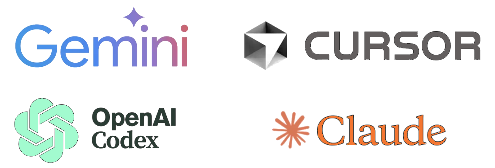

**Repository:** https://github.com/aotuai/Structured_Vibe_Coding  
**License:** BSD. Use the Structured Vibe Coding CLI tools at your own risk; PRs welcome. Keep changes tiny, logs clear, and defaults sensible.



Author's experience:
> Want to leverage frontier models like Claude Fable 5 without skyrocketing your AI bill?
>
> Using our open-source **Structured Vibe Coding CLI tool and methodology**, we generated 90% of the production code for BrainFrame and VisionCapsules using Claude, Gemini, and ChatGPT.
>
> Over the past 1.5 years, we’ve tackled everything from quick fixes to massive architectural tasks—all on a lean monthly budget of **$20–$200**.
>
> We achieved this without relying on Codex, Cursor, or heavy autonomous agents. It’s designed for veteran software and algorithm engineers with deep experience in Python, web development, C/C++, Linux, and Git who want tight control over their LLMs and budget.
>
> Open sourced here: https://github.com/aotuai/Structured_Vibe_Coding

- [1. Philosophy: Structured Vibe Coding](#1-philosophy-structured-vibe-coding)
  - [1.1. Who is this for?](#11-who-is-this-for)
- [2. The Structured Blueprint Method](#2-the-structured-blueprint-method)
  - [2.1. Prerequisites](#21-prerequisites)
  - [2.2. Align Requirements Between AI and Human](#22-align-requirements-between-ai-and-human)
    - [2.2.1. Prompt: Reflect the scope with change\_request\_prompt.md](#221-prompt-reflect-the-scope-with-change_request_promptmd)
  - [2.3. Co-Design with AI](#23-co-design-with-ai)
    - [2.3.1. Prompt: Generate coding\_prompt.md for AI, update DESIGN.md for human](#231-prompt-generate-coding_promptmd-for-ai-update-designmd-for-human)
  - [2.4. Code and Test with Human Verification](#24-code-and-test-with-human-verification)
    - [2.4.1. Prompt: Code by AI](#241-prompt-code-by-ai)
    - [2.4.2. Prompt: Test with Human Verification](#242-prompt-test-with-human-verification)
- [3. Vibe Coding Tools](#3-vibe-coding-tools)
  - [3.1. Quick Start](#31-quick-start)
  - [3.2. `concatenate_text_files.py`](#32-concatenate_text_filespy)
  - [3.3. `concatenate_python_files.py`](#33-concatenate_python_filespy)
  - [3.4. `save_commits.py`](#34-save_commitspy)
  - [3.5. `analyze_folder.py`](#35-analyze_folderpy)
- [4. Workflow Examples](#4-workflow-examples)
  - [4.1. Whole-project review](#41-whole-project-review)
  - [4.2. Python bug fix in a small tool](#42-python-bug-fix-in-a-small-tool)
  - [4.3. Focused PR feedback](#43-focused-pr-feedback)
  - [4.4. The Blueprint Method](#44-the-blueprint-method)
- [5. FAQ](#5-faq)

---

# 1. Philosophy: Structured Vibe Coding

Fundamentally, Agentic IDEs (like Cursor or Copilot) introduce a middleman into your workflow. They wrap the underlying foundation models in a black box, relying on hidden system prompts and automated, unpredictable context-gathering.

Structured Vibe Coding explicitly rejects the black box. It operates on two core pillars:

* **Vobe Coding Tooling**: Scripts that allow humans to share exact context with the AI, and for the AI to return complete files back to the human. So the interaction with AI is transparent to the user.
  * **Concatenate scripts:** Package source code, git history, requirements and design documents for dropping into a chat interface
  * **Code retrieval tools:** Retrieve output and dropping back to the repository (To be developed, **PRs welcome**)
* **Structured Blueprint Workflows**: A clear, phase-based framework that forces the AI to collaborate exactly how a junior and senior software engineer would interact:
  * **Requirements Clarification** 
  * **Design Constraint Confirmation** 
  * **Code & Test Verification**

| Feature | Structured Vibe Coding  | Agentic IDEs (Cursor/Copilot) |
| :--- | :--- | :--- |
| **Target User** | **Production Engineering.** CLI-comfortable devs and budget-conscious teams. | **Speed-Focused Devs.** Individuals rapidly prototyping. Output often requires a separate engineering pass for production. |
| **Context Control** | **Absolute.** You build the exact text file using the CLI tools. | **Low.** The IDE guesses what matters via RAG. |
| **Transparency** | **High.** Prompts are version-controlled docs. | **Low.** Hidden system prompts and hidden RAG. |
| **Iteration Speed** | **High Overall**. Reaches production faster by giving human developer context controls to avoid rework. | **Medium Overall**. Frictionless for micro-edits, but automated drafting often leads to context loss and rework. |
| **Cost** | **Predictable.** Fully control by human developer. | **Non Predictable.** Often exceed Monthly IDE subscription tiers. |
| **Vendor Lock-in** | **None.** Works with Claude, GPT, local models. | **High.** Tied to their specific interface/servers. |

For small features, you don't need the Structured Blueprint Method — jump straight to [Vibe Coding Tools](#3-vibe-coding-tools). This toolkit is for software engineers comfortable with the command line.

- **Chat-only workflow:** AI is changing fast — don't lock yourself in to any one model or tool.
- **Requirements, design, and coding:** Have AI confirm each stage before moving to the next.
- **Git and diff:** Communicate with the AI through git history and diffs so it can reason over the exact context you see.

For larger features, asking an AI to design architecture and write code at the same time often leads to hallucinations and context drift. Use **The Blueprint Method**: a structured three-phase methodology that shifts AI from a guessing machine to a precise execution engine.

## 1.1. Who is this for?

- **Minimize cost.** Flat-rate chat subscriptions instead of token-metered agentic tools — predictable spend for solo developers, students, contractors, and small teams.
- **Switch models freely.** The same text bundle drops into any chat — Private AI (self-hosted Llama, DeepSeek, Qwen), Claude, GPT, Gemini — so you pick the best model per task without changing tools.
- **Production Software Engineering.** The Blueprint Method (requirements → design → code, with verification gates) outlives any specific tool or model.

---

# 2. The Structured Blueprint Method

A methodology that gets explicit confirmation at each step: requirements → design → coding. Humans and AI stay aligned without rework or context drift.

## 2.1. Prerequisites

Move your design, requirement, and test documents into Markdown format, for example, DESIGN.md in the repository.

VS Code, with a few extensions, gives you a Word/Google Docs-like editing experience for Markdown:

- Export Google Docs to HTML ZIP, then convert the HTML into Markdown with Pandoc:
  ```
  pandoc GoogleDocExport.html --wrap=none --markdown-headings=atx -f html-native_divs-native_spans -t gfm-smart --extract-media=. -o CleanedDocExport.md
  ```
- Use Mermaid `sequenceDiagram` for inline interaction sequences.
- Use Mermaid `graph TD` for inline flowcharts and architecture diagrams.
- Use drawio for diagrams, then export to SVG and embed inline in your Markdown.
- Use GitHub Flavored Markdown (GFM) for tables.
- Use the **Markdown All-in-One** extension for section numbering and the Table of Contents.

## 2.2. Align Requirements Between AI and Human

Feed the AI your change request and ask it to audit for edge cases before any code is written.

### 2.2.1. Prompt: Reflect the scope with change_request_prompt.md

1. Place change_request_prompt.md in the my_app/design_docs/ folder along with design documents, e.g., DESIGN.md.

2. Package the related source code and document files with Vibe Coding Tools For example,

```bash
python3 ./Structured_Vibe_Coding/concatenate_text_files.py my_app/ --recursive
```
This will generate a file my_app_concat.txt

3. Drop the my_app_concat.txt in AI chat window along with the following prompt,

> Audit the feature requests change_request_prompt.md. Stop and ask for clarification if you find any logical gaps, unhandled edge cases, contradictions, or missing data dependencies.
>
> The Ground Truth Principle: Treat the codebase as the absolute source of truth. Markdown design files are historic intent. If they clash, the code wins.
> If there are no pending clarifications, update `change_request_prompt.md` incorporating the following instructions:
> 
> - Incremental Scoping: Break the feature down into sub-features that build upon each other. Each sub-feature must be user-verifiable without depending on the next. Do not include details already implemented in the codebase.
> - Acceptance Criteria: Define the feature requests using strict Given-When-Then format. Use strictly user-verifiable language—do not use underlying codebase or architectural terminology.
>
> Wait for my approval on the change_request_prompt.md and answers to any clarifications before writing any code or architecture design.

Note that the initial version of change_request_prompt.md can be drafted in any format by the user.

## 2.3. Co-Design with AI

Have the AI map out *how* the change request integrates into the codebase by updating your design docs (`DESIGN.md` or any Mermaid diagrams). You may skip this step for small features.

### 2.3.1. Prompt: Generate coding_prompt.md for AI, update DESIGN.md for human

> Based on the `change_request_prompt.md` and the codebase context, generate or update design documents in `design_docs/` for human read. and generate a strict step-by-step `coding_prompt.md` for AI execution. Do not include in `coding_prompt.md` any details already implemented in the codebase. Wait for my approval.
>
> The Ground Truth Principle: Treat your codebase as the absolute source of truth. Design docs are historic intent. If they clash, the code wins.
>
> When updating the design documents, edit only what this change affects. Capture architecture changes, API changes, and external constraints — not low-level implementation details, which live in the code.
>
> The architecture diagrams as .drawio.svg files for you to update. Preserve the embedded draw.io XML so the diagrams stay editable by human when needed.
> If there are user-facing impacts, which affects change_request_prompt.md, ask for my confirmation.

## 2.4. Code and Test with Human Verification

Feed the AI the generated `coding_prompt.md` and force it to code incrementally.

### 2.4.1. Prompt: Code by AI

> Execute step `...` of the prompt. Write complete, production-ready code with no placeholders. Stop and wait for me to verify the tests pass before moving to the next step.
>
> Coding Constraints:
> - Generate the whole file: Always output the complete file content in zip file so I can download, unzip and replace my local copy directly.
> - Minimal changes only: Do the absolute minimum required to accomplish the task. Do not expand the scope. If you feel a broader architectural change is necessary, ask for my approval first.
> - Zero cosmetic changes: I manually review every line using diff tools. Do not reformat existing code, change indentation, merge/split lines, or modify/add/remove comments. Leave the surrounding code exactly as you found it to keep the diff clean.
>
> Please provide commit text along with your results.

### 2.4.2. Prompt: Test with Human Verification

> Here is the test results.
>
> - Crashing? Yes/No
> - Inputted:
> - The output is incorrect? Yes/No
> - Outputted:
> - Logs attached:
> - Expected output:
> 
> Please review the logic. Add logging if you need me to trace the execution steps.

---

# 3. Vibe Coding Tools

Keep it simple. These small scripts package the **right** text or code so you can drop a file, folder, or file type into a chat-based AI. **No lock-in** to any model or tool.

## 3.1. Quick Start

```bash
python3 -m venv venv && source venv/bin/activate
# run any tool with: python3 <tool>.py [args]
```

1. Run a tool below to generate a **single text file**.
2. Attach or paste that file into your coding chat.
3. Prompt the AI for what you want — review, refactor, tests, bug fix, or a Blueprint Method phase.

---

## 3.2. `concatenate_text_files.py`

*Snapshot all text files in a repo.*

**What:** Recursively collects text-like files (`.py`, `.md`, `.json`, etc.), skips noisy folders (`.git/`, `node_modules/`, `dist/`, etc.), and writes one bundle with a header per file.

**Why:** Share the **whole project context** in chat without zipping.

**Usage:**
```bash
python3 concatenate_text_files.py path/to/project --recursive
# → creates ./<project>.txt containing all included files with headers
```

The script supports `--code-only` and `--py-only` options to reduce the number of files included in the package.

---

## 3.3. `concatenate_python_files.py`

*Bundle a script plus its local imports.*

**What:** Traces local Python imports starting from one or more entry scripts and concatenates those files into a single text artifact.

**Why:** Give AI the **exact Python dependency closure** it needs for reasoning, without external packages.

**Usage:**
```bash
python3 concatenate_python_files.py project_root/ path/to/main.py [another.py ...]
# → writes project_root_concatenated.txt
```

---

## 3.4. `save_commits.py`

*Package the files changed in a commit or range.*

**What:** Finds files changed in one commit (or between two commits) and writes their contents to a single text file with commit headers.

**Why:** Share **focused diffs** for targeted reviews or debugging.

**Usage:**
```bash
# Single commit
python3 save_commits.py --this f9e8d7c

# Range (base..this)
python3 save_commits.py --base a1b2c3d --this f9e8d7c
# → writes <this>.txt or base-this.txt
```

---

## 3.5. `analyze_folder.py`

*Quick repo inventory.*

**What:** Scans a directory, groups files by type, totals sizes, and shows a small table (count, total size, example largest file). No bundle output — just fast insight.

**Why:** Decide **what to package** (and what to ignore) before chatting.

**Usage:**
```bash
python3 analyze_folder.py              # analyze current folder
python3 analyze_folder.py path/to/dir  # analyze a specific directory
```

---

# 4. Workflow Examples

## 4.1. Whole-project review

1. `python3 concatenate_text_files.py ./myapp` → `myapp.txt`
2. Attach `myapp.txt` in chat.
3. Ask: *"Review for structure, add tests for X, and propose a minimal refactor."*

## 4.2. Python bug fix in a small tool

1. `python3 concatenate_python_files.py ./tools ./tools/runner.py` → `tools_concatenated.txt`
2. Attach; ask: *"There's a crash when input is empty. Fix it and add doctests."*

## 4.3. Focused PR feedback

1. `python3 save_commits.py --base abc123 --this def456` → `abc123-def456.txt`
2. Attach; ask: *"Explain risk, edge cases, and missing tests in this change."*

## 4.4. The Blueprint Method

1. `python3 concatenate_text_files.py ./myapp --code-only` → `myapp_code.txt`
2. Attach `myapp_code.txt` along with your `requirement_prompt.md`.
3. Follow the prompts in Section **The Blueprint Method** to design and execute without context drift.

---

# 5. FAQ

**Why text instead of zip?** Text is immediately visible and searchable in chat, avoids unzip friction, and keeps you and the AI tightly in sync.

**Does this include third-party dependencies?** No — these tools focus on your source and local imports. Mention external packages in your prompt or attach your `change_request_prompt.md`.

